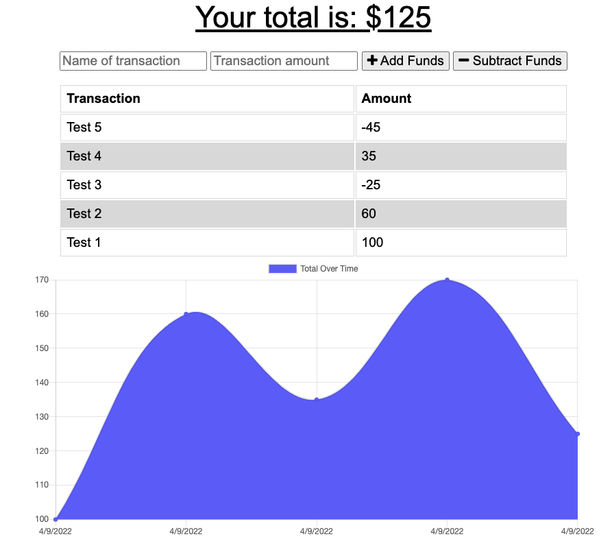

# Budget Tracker

GitHub: https://github.com/patty345/budget-tracker

Heroku app: https://budget-tracker-2456.herokuapp.com/

# Description

- WHEN the user inputs an expense or deposit
- THEN they will receive a notification that they have added an expense or deposit
- WHEN the user reestablishes an internet connection
- THEN the deposits or expenses added while they were offline are added to their transaction history and their totals are updated

# Usage

This application will allow users to create new transactions for deposit or withdraw, with or without internet connection

# Screen Captions

# Technologies Used

- Node.js
- Express
- JavaScript
- MongoDB
- Mongoose
- Progressive Web Application

# OutPut

- To give users fast and easy way to track their money, and having the offline functionallity